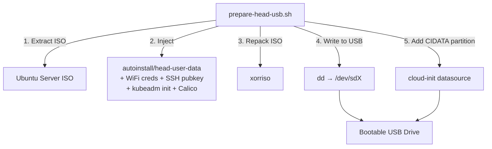
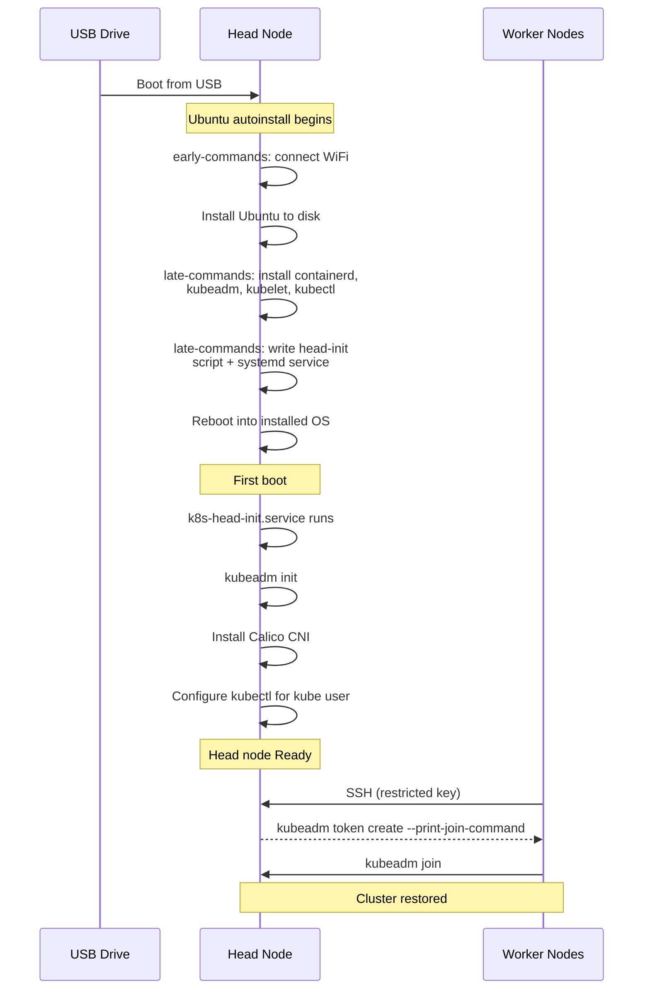

# prepare-head-usb.sh

`prepare-head-usb.sh` builds a bootable USB drive that installs and configures a Kubernetes
head (control-plane) node from scratch. Boot from the USB, select the install option in GRUB,
and walk away — Ubuntu installs, containerd + kubeadm are set up, the cluster is initialised
with Calico CNI, and SSH is configured so workers can auto-join.

Use it when:
- The head node's disk died or the OS is corrupted
- You want to migrate the control plane to different hardware
- You're setting up the cluster for the first time

> **Note:** This creates a *fresh* cluster. Workers with the auto-join service
> will rejoin automatically once they can reach the new head node IP.

## Architecture





## Prerequisites

| Requirement | Details |
|---|---|
| Ubuntu ISO | Ubuntu Server 24.04 LTS in the repo directory ([download](https://ubuntu.com/download/server)) |
| xorriso | `sudo apt install xorriso` |
| SSH keypair | `keys/node-join` + `keys/node-join.pub` (same pair used by worker USBs) |
| WiFi credentials | SSID + password (via `secrets.env` or environment variables) |

For the 4-step version, see [quickstart-head.md](quickstart-head.md).

## Usage

### 1. Generate SSH key (if you don't already have one)

```bash
ssh-keygen -t ed25519 -f keys/node-join -N '' -C k8s-node-auto-join
```

This is the same keypair used by `prepare-usb.sh` for workers. The **private** key goes on
worker nodes; the **public** key is installed on the head node's `authorized_keys` restricted
to only run `kubeadm token create --print-join-command`.

### 2. Configure secrets

```bash
cp secrets.env.example secrets.env
```

Edit `secrets.env`:
```bash
WIFI_SSID="your-ssid"
WIFI_PASSWORD="your-password"
PASSWORD_HASH='$6$...'   # mkpasswd --method=SHA-512 yourpassword
```

Or skip the file — the script will prompt for anything missing.

### 3. Run `prepare-head-usb.sh`

```bash
sudo bash prepare-head-usb.sh            # auto-detects USB drive
sudo bash prepare-head-usb.sh /dev/sdX   # or specify explicitly
```

The script will:
1. Extract the Ubuntu Server ISO
2. Inject the head-node autoinstall config (WiFi, SSH pubkey, kubeadm init, Calico)
3. Repack the ISO with xorriso
4. Write the ISO to the USB with dd
5. Create a CIDATA partition for cloud-init

**Environment variables:**

| Variable | Default | Description |
|---|---|---|
| `WIFI_SSID` | *(prompt)* | WiFi network name |
| `WIFI_PASSWORD` | *(prompt)* | WiFi password |
| `PASSWORD_HASH` | *(prompt)* | SHA-512 hash for the `kube` user (`mkpasswd --method=SHA-512`) |
| `POD_CIDR` | `192.172.0.0/16` | Pod network CIDR (must match `calico.yaml`) |
| `UBUNTU_ISO` | auto-detected | Path to Ubuntu Server 24.04 ISO |

Before erasing, the script shows drive info and offers to list its current contents.

### 4. Boot the head node

1. Plug USB into the target machine and boot from it
2. Select **"WIPE DISK & Install Kubernetes HEAD Node"** from GRUB
   - Default (30 s timeout) is safe boot-from-disk — nothing happens if you don't choose
3. Walk away — install is fully automated

### 5. Verify after first boot

```bash
ssh kube@<head-node-ip>
kubectl get nodes       # k8s-head  Ready
kubectl get pods -A     # calico + coredns Running
```

## What the USB Does on First Boot

The `k8s-head-init` systemd service runs once automatically:

1. **kubeadm init** with the configured pod CIDR
2. **Calico CNI** — Tigera operator + Installation CR (VXLANCrossSubnet)
3. **kubectl** configured for both `kube` and `root` users
4. **SSH authorized_keys** — `node-join.pub` restricted to `kubeadm token create --print-join-command`

## Comparison with `prepare-usb.sh` (workers)

| | `prepare-usb.sh` (worker) | `prepare-head-usb.sh` (head) |
|---|---|---|
| Autoinstall template | `autoinstall/user-data` | `autoinstall/head-user-data` |
| SSH key | Private key → SSH to master | Public key → `authorized_keys` |
| First-boot service | `k8s-auto-join` (joins cluster) | `k8s-head-init` (creates cluster) |
| Script inputs | MASTER_IP, MASTER_USER | POD_CIDR |
| Hostname | `k8s-node-<mac>` | `k8s-head` |

## Reconnecting Workers

If the head node IP hasn't changed, workers with the auto-join service will rejoin automatically on their next boot (or service restart).

If the head node IP **has changed**:
1. Re-burn worker USB drives with `MASTER_IP=<new-ip>` in `secrets.env`
2. Or manually update `/usr/local/bin/k8s-auto-join.sh` on each worker and delete `/etc/kubernetes/.joined`, then reboot

## Troubleshooting

**Head-init service logs:**
```bash
journalctl -u k8s-head-init.service
cat /var/log/k8s-head-init.log
```

**Collect all logs to USB** (plug in the install USB first):
```bash
sudo ~/save-logs.sh
```

**Re-run head init manually** (if the service failed):
```bash
sudo rm /etc/kubernetes/.head-init-done
sudo systemctl start k8s-head-init.service
```

**Check Calico status:**
```bash
kubectl get pods -n calico-system
kubectl get installation default -o yaml
```

## Project Structure (head-related files)

```
├── autoinstall/
│   ├── head-user-data     # Cloud-init autoinstall config for head node
│   ├── user-data          # Cloud-init autoinstall config for workers
│   └── meta-data          # Cloud-init metadata (shared)
├── keys/                  # SSH keypair for auto-join (gitignored)
│   ├── node-join          # Private key (installed on workers)
│   └── node-join.pub      # Public key (installed on head node)
├── prepare-head-usb.sh    # Builds and flashes the head-node USB
├── prepare-usb.sh         # Builds and flashes worker USB drives
├── calico.yaml            # Calico CNI config (referenced by head-init)
├── quickstart-head.md     # Short quickstart for head node
└── secrets.env.example    # Template for credentials
```
