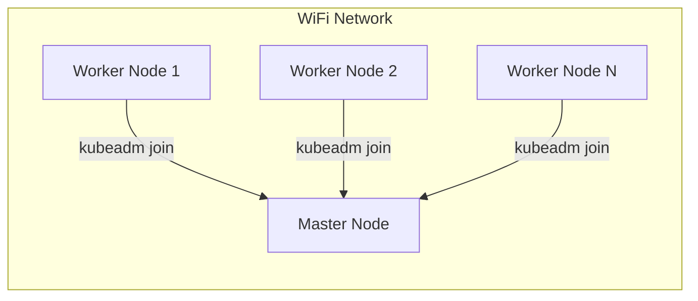
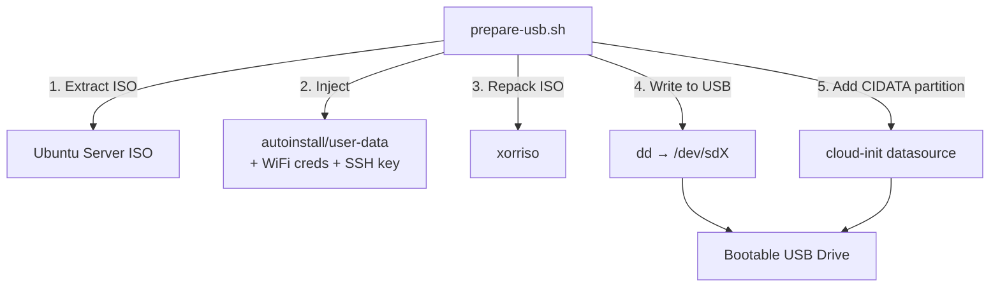
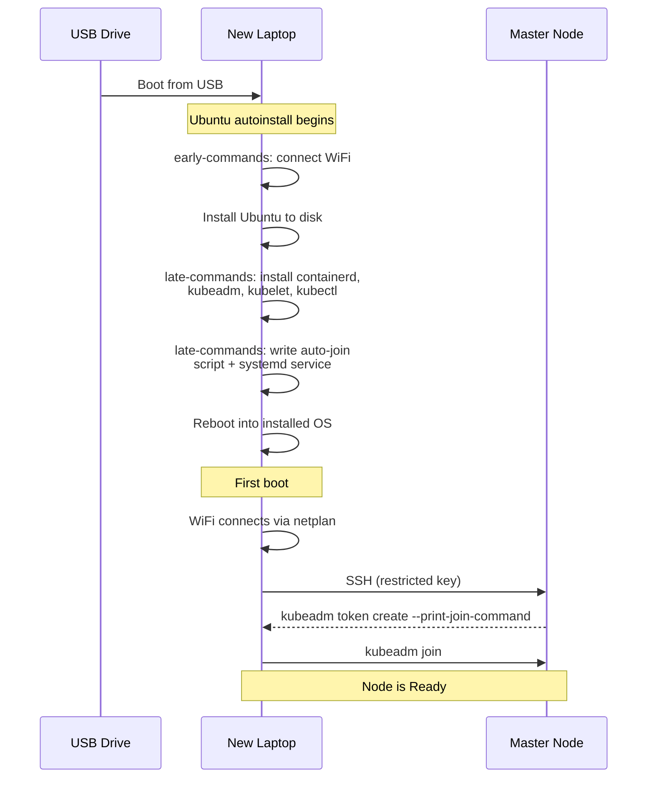

# Kubernetes Cluster on Laptops

Automated Kubernetes cluster provisioning over WiFi using a single USB drive.
Boot a laptop from the USB — it installs Ubuntu, sets up containerd + kubeadm,
and auto-joins the cluster. No interaction needed.

## Architecture



| Component   | Version |
|-------------|---------|
| Ubuntu      | 24.04 LTS |
| Kubernetes  | 1.35 |
| CNI         | Calico 3.29.2 |
| Runtime     | containerd |
| Pod CIDR    | (configured in calico.yaml) |

## How It Works





## Quick Start

### 1. Prepare the master

```bash
# Initialize cluster
sudo kubeadm init \
  --apiserver-advertise-address=<MASTER_IP> \
  --pod-network-cidr=<POD_CIDR> \
  --node-name=$(hostname | tr 'A-Z' 'a-z')

# Set up kubeconfig
mkdir -p $HOME/.kube
sudo cp -i /etc/kubernetes/admin.conf $HOME/.kube/config
sudo chown $(id -u):$(id -g) $HOME/.kube/config

# Install Calico CNI
kubectl create -f https://raw.githubusercontent.com/projectcalico/calico/v3.29.2/manifests/tigera-operator.yaml
kubectl apply -f calico.yaml
```

### 2. Create the SSH key for auto-join

```bash
ssh-keygen -t ed25519 -f keys/node-join -N '' -C k8s-node-auto-join
```

Add the public key to the master's `~/.ssh/authorized_keys` with a forced command:

```
command="kubeadm token create --print-join-command",no-port-forwarding,no-x11-forwarding,no-agent-forwarding ssh-ed25519 AAAA... k8s-node-auto-join
```

### 3. Prepare the USB drive

```bash
# Set up secrets (WiFi + password)
cp secrets.env.example secrets.env
# Edit secrets.env with your values

# Build and flash the USB (auto-detects the USB drive)
sudo apt install xorriso
sudo bash prepare-usb.sh
```

The script auto-detects the USB drive. If multiple are plugged in, it lists them
and asks you to pick. You can also specify explicitly: `sudo bash prepare-usb.sh /dev/sdX`.
Before erasing, it offers to list the drive's current contents.

### 4. Provision worker nodes

1. Plug USB into a laptop, boot from it
2. Walk away — installs and joins automatically
3. Verify: `kubectl get nodes`
4. Unplug USB, repeat on next laptop

## Project Structure

```
├── autoinstall/
│   ├── user-data          # Cloud-init autoinstall config (template)
│   └── meta-data          # Cloud-init metadata
├── keys/                  # SSH keypair for auto-join (gitignored)
├── prepare-usb.sh         # Builds and flashes the USB drive
├── prepare-head-usb.sh    # Builds and flashes the head-node USB
├── node-setup.sh          # Manual node setup (alternative to USB)
├── deploy-monitoring.sh   # Deploys Prometheus + Grafana monitoring
├── lib/
│   └── usb-helpers.sh     # Shared functions for USB prep scripts
├── tests/
│   └── usb-helpers.bats   # Unit tests (bats)
├── calico.yaml            # Calico CNI config (custom pod CIDR)
├── quickstart.md          # Detailed setup notes
├── secrets.env.example    # Template for WiFi + password credentials
└── secrets.env            # Your actual credentials (gitignored)
```

## Tests

Unit tests use [bats](https://github.com/bats-core/bats-core) and cover the shared validation, template rendering, and config generation in `lib/usb-helpers.sh`. No root, USB drive, or ISO required.

```bash
sudo apt install bats
bats tests/usb-helpers.bats
```

## Troubleshooting

**Check node status from the master:**
```bash
kubectl get nodes
```

**Collect logs from an installed node** (plug in USB first):
```bash
sudo ~/save-logs.sh
```

Boot logs are also auto-saved to the USB's CIDATA partition under `boot-logs/<hostname>/`.

**Regenerate join token** (tokens expire after 24h):
```bash
kubeadm token create --print-join-command
```

## Monitoring

Deploy Prometheus + Grafana for CPU, per-core, and thread monitoring:

```bash
bash deploy-monitoring.sh
```

This installs the kube-prometheus-stack (Prometheus, Grafana, node-exporter, kube-state-metrics).

Access Grafana:
```bash
kubectl port-forward -n monitoring svc/kube-prometheus-stack-grafana 3000:80
# Open http://localhost:3000  (admin / prom-operator)
```

Pre-installed dashboards:
- **Node Exporter / Nodes** — per-core CPU usage, load averages, thread counts
- **K8s / Compute Resources / Cluster** — cluster-wide CPU/memory overview
- **K8s / Compute Resources / Pod** — per-pod breakdown on each node
